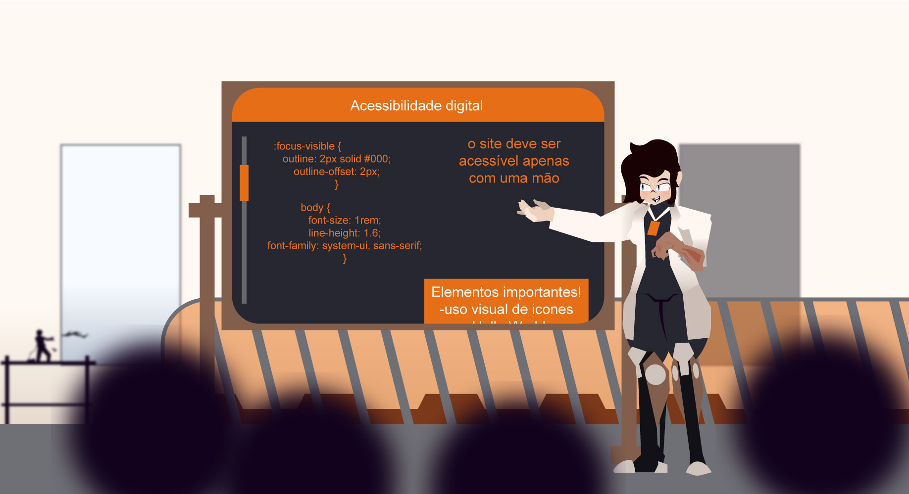

<h1 align="center"> Quais as dificuldades na criação de um design acessível?</h1>

<h2>Spike e PoC relacionado a design acessível usando CSS</h2>

Hoje, mais de um bilhão de pessoas tem algum tipo de deficiência física ou mental. Dessas enorme quantidade de pessoas, 75% delas tem algum tipo de deficiência invisível, geralmente psicológica (TDaH, Autismo, ansiedade etc).

Quais elementos são necessários para fazer um site realmente acessível tanto para usuários com deficiências físicas, como deficiências mentais invisíveis?

<h3>Design acessível</h3>

 O que seria o <i>"Design acessível?"</i>, em resumo, é o uso consciente de cores, contrastes, tipografia, espaçamentos e estrutura para tornar o conteúdo da web fácil de ler, entender e navegar. Essas boas práticas garantem que aparelhos com funções de ajuda para usuários com deficiência consigam ler, de forma coerente, o conteúdo do site. Além de garantir que usuários com TDaH ou autismo consigam compreender o conteúdo sem se sentirem confusos.

<b>É importante que o Design seja pensado desde o início para ser acessível!!!</b>

Isso garante o contínuo uso de boas práticas, uma visão acessível e vai impedir o arduo trabalho mudar todas as tags pelas suas alternativas semâniticas no futuro.

<h3>Karsater CORP.</h3>

O conteúdo do site apenas serve para manter o storytelling, por isso há alguns flares e coisas estranhas acontecendo ao redor da página, mas tudo é com intenções de mostrar uma sequênca de acontecimentos que levam até o que a Purah é hoje.

